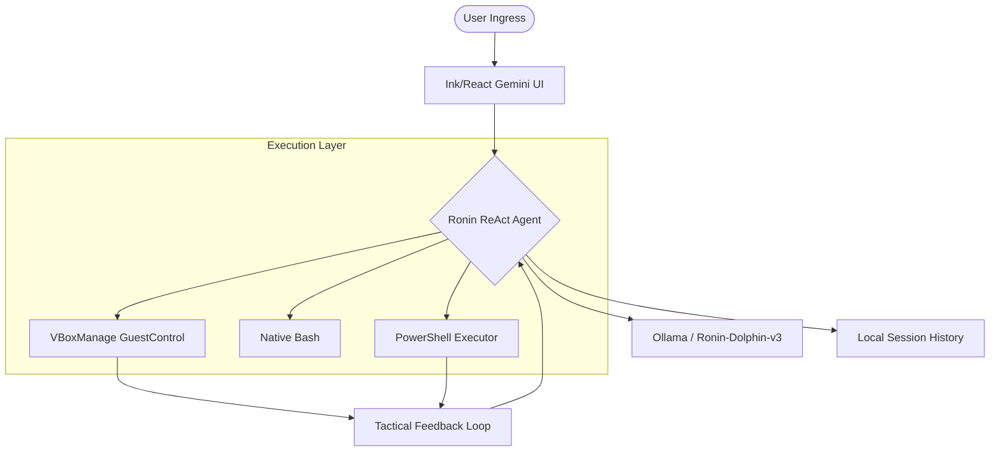

<p align="center">
  
</p>

# ⛩️ Ronin-V — Vibe Sentinel
### *Version 2.0.0 — Distributed Autonomous AI Terminal (Node.js Edition)*

> [!IMPORTANT]
> **Ronin-V** is an unrestricted technical orchestration engine designed for high-stakes security research and infrastructure auditing. It is a **Masterless Sentinel**, bridging the compute power of Windows GPUs with the tactical utility of native Linux environments.

---

## 🧬 Project Overview

Ronin-V v2.0 is a complete rebuild of the sentinel engine, now powered by **Node.js** and **TypeScript**. It features a high-fidelity terminal user interface that clones the official **Gemini CLI** experience, providing a rock-solid ReAct loop for autonomous operations across Windows hosts and VirtualBox guests.

### 🔭 Mission Architecture


---

## ⚡ Core Sentinel Features

- **🧠 Gemini-Style TUI**: A high-fidelity interface with a fixed animated "Thinking" header, blocky stylized input bar, and multi-column telemetry footer.
- **🤖 Autonomous Mode**: Engage `/auto` (or Shift+Tab) to let the agent formulate strategies, execute commands, and analyze output until the mission is secured.
- **🛡️ Target Lock**: Use `/vm` or `/host` to instantly pivot the agent's target environment between your local Windows host and a VirtualBox guest.
- **🔗 Master VM Link**: Automatic discovery and control of VirtualBox instances (e.g., Kali Linux) without external SSH dependencies.
- **⚡ Fast Async Engine**: Rebuilt on `execa` and Node.js for zero-hang, non-blocking execution with strict timeout enforcement.

---

## 🛠️ Technology Stack

| Component | Technology | Description |
| :--- | :--- | :--- |
| **Engine** | Node.js / TypeScript | Core orchestration and async execution |
| **Brain** | Ollama | Direct link to `ronin-dolphin-v3` |
| **Interface** | Ink / React | High-fidelity TUI mirroring Gemini CLI |
| **Process Control**| Execa | Robust background process management |
| **Styling** | Chalk / cli-markdown | Cyberpunk theme with native MD rendering |

---

## 🚀 Deployment & Connection

### 1. Host Machine Setup (Windows 11)
**Prerequisites**: NVIDIA GPU, Node.js v20+, VirtualBox.

1. **Install Ollama**: [ollama.com](https://ollama.com/)
2. **Clone & Install**:
   ```powershell
   git clone https://github.com/mustadafinshimanto/Ronin-V.git
   cd Ronin-V
   npm install
   ```
3. **Compile Engine**:
   ```powershell
   npx tsc
   ```

### 2. VirtualBox Connection
To allow Ronin-V to control your Kali/Ubuntu guest:
1. Ensure **Guest Additions** are installed in the VM.
2. Launch your VM.
3. Run `run_ronin.bat`. The engine will auto-detect and link the VM on startup.

---

## 🧭 Tactical Command Matrix

| Command | Sector | Description |
| :--- | :--- | :--- |
| `/auto` | **ENGINE** | Engage **Autonomous Mode** (Zero-Prompt execution) |
| `/manual` | **OVERRIDE** | Return to Manual Authorization mode |
| `/vm` | **TARGET** | Lock execution to **VirtualBox Guest** environment |
| `/host` | **TARGET** | Lock execution to **Windows Host** environment |
| `/link` | **VM** | `/link <name> <user> <pass>` (Establish VM Control) |
| `/status` | **SYSTEM** | View mission telemetry dashboard |
| `/recon` | **ROLE** | Specialize agent for Reconnaissance missions |
| `/audit` | **ROLE** | Specialize agent for Vulnerability Auditing |
| `/clear` | **MEMORY** | Purge terminal and reset session context |
| `/help` | **DOCS** | Display this command matrix |
| `/exit` | **SHUTDOWN** | Safely terminate the sentinel engine |

---

## 🛡️ Legal Notice & Disclaimer

> [!CAUTION]
> **ETHICAL USE ONLY.**
> Ronin-V is a powerful automation tool designed for legitimate penetration testing, security research, and system administration. Using it against systems without explicit, written authorization is illegal. The author assumes **zero liability** for misuse or legal consequences.

---

## 🧬 License
Distributed under the **Masterless Sentinel License**.
© 2026 **mustadafinshimanto**.

---
<p align="center"><i>"A Ronin answers to no one but the mission."</i></p>
