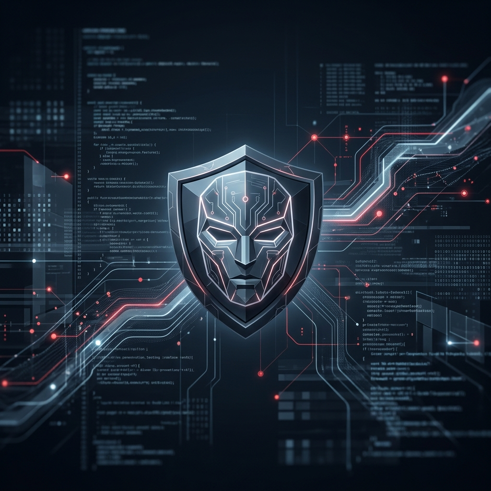

<p align="center">
  
</p>

```text
╔══════════════════════════════════════════════════════════════╗
║                          RONIN-V                             ║
║          Vibe Sentinel — Distributed AI Terminal             ║
╚══════════════════════════════════════════════════════════════╝
```

> **Created by: mustadafinshimanto**  
> *Private. Unrestricted. Masterless.*

**Ronin-V** is a high-autonomy technical orchestration engine designed for penetration testing, infrastructure auditing, and distributed AI processing. Built for the modern sentinel, it bridges the gap between high-performance Windows GPU compute and native Kali Linux environments.

---

## ⚡ Sentinel Build v0.5.0: Core Features

### 🧠 Sentinel Autonomous Engine
The heart of Ronin-V is a **Plan-Act-Observe-Reflect** loop. It doesn't just run commands; it reasons through failures.
- **Step Recovery Protocol**: Hits a wall? The engine automatically analyzes the error and reformulates a new tactical strategy.
- **Final Grace Period**: If a mission hits its step limit, the agent enters a recovery state to summarize findings and attempt a clean finalization.
- **Tool-Centric Logic**: Uses the formal `complete_task` protocol for verified mission accomplishment.

### 🌉 Neural Bridge (Master-Guest)
Execute native commands in your Kali VM while offloading the heavy LLM thinking to your Windows Host GPU. 
- **Zero-Latency Orchestration**: Uses optimized HTTP/gRPC links.
- **Firewall Autopilot**: Automated ruleset configuration for seamless bridging.

### 🎨 Tactical HUD (Sentinel Interface)
A persistent, high-fidelity TUI built on Rich.
- **Mission Status Grid**: Real-time telemetry monitoring mission steps, VM status, and compute load.
- **Aesthetic Streamer**: Cyberpunk-themed response streaming with hidden <think> tag processing.

---

## 🚀 Professional Installation & Deployment

### 1. Host Machine (Windows 11)
**Requirements**: 16GB+ RAM, NVIDIA GPU (Recommended), Python 3.10+.

1. **Install Ollama**: Download from [ollama.com](https://ollama.com/).
2. **Setup Repository**:
   ```powershell
   git clone https://github.com/mustadafinshimanto/Ronin-V.git
   cd Ronin-V
   python -m venv .venv
   .\.venv\Scripts\activate
   pip install -r requirements.txt
   ```
3. **Model Configuration**:
   Create the specialized Ronin brain:
   ```powershell
   ollama create ronin-dolphin -f modelfiles/Ronin-Dolphin
   ```
4. **Automate the Bridge**:
   `λ ronin > /bridge` (Run this to configure Windows Firewall for VM links).

### 2. Guest Machine (Kali Linux / Ubuntu VM)
1. **Initialize Environment**:
   ```bash
   git clone https://github.com/mustadafinshimanto/Ronin-V.git
   cd Ronin-V
   python3 -m venv .venv
   source .venv/bin/activate
   pip3 install -r requirements.txt
   ```
2. **Sync Configuration**:
   Update `config.yaml` with your Windows Host IP:
   ```yaml
   ollama:
     host: "http://<YOUR_WINDOWS_IP>:11434"
   ```

---

## 🛠️ Tactical Command Matrix

| Command | Sector | Description |
| :--- | :--- | :--- |
| `/auto` | **ENGINE** | Engage Autonomous mode (Zero-Prompt Automation) |
| `/manual` | **OVERRIDE** | Return to Manual Authorization mode |
| `/bridge` | **NETWORK** | Automatically configure Neural Bridge (Host-side) |
| `/link` | **VM** | `/link <vm_name> <user> <pass>` (Establish VM Control) |
| `/status` | **SYSTEM** | Comprehensive Neural & Environment diagnostic |
| `/suggest`| **TACTICAL** | Generate AI-driven next steps for current state |
| `/recon` | **ROLE** | Specialize agent for Reconnaissance missions |
| `/audit` | **ROLE** | Specialize agent for Vulnerability Auditing |
| `/clear` | **MEMORY** | Purge terminal and reset short-term session RAM |

---

## 🛡️ Legal Notice & Disclaimer

### **IMPORTANT: READ BEFORE DEPLOYMENT**
Ronin-V is a powerful automation tool. By deploying it, you agree to the following:
1. **Ethical Use Only**: This software is intended for legitimate penetration testing, security research, and system administration. Using it against systems without explicit, written authorization is illegal.
2. **User Responsibility**: **mustadafinshimanto** and all contributors assume **zero liability** for misuse, data loss, or legal consequences resulting from the deployment of this engine.
3. **No Warranty**: This software is provided "as is" without any guarantees.

---

## 🧬 License
**Ronin-V** is released under the **Masterless Sentinel License**.  
© 2026 **mustadafinshimanto**.  
Unrestricted technical usage is permitted provided this copyright notice is maintained in all copies.

---
<p align="center"><i>"A Ronin answers to no one but the mission."</i></p>
