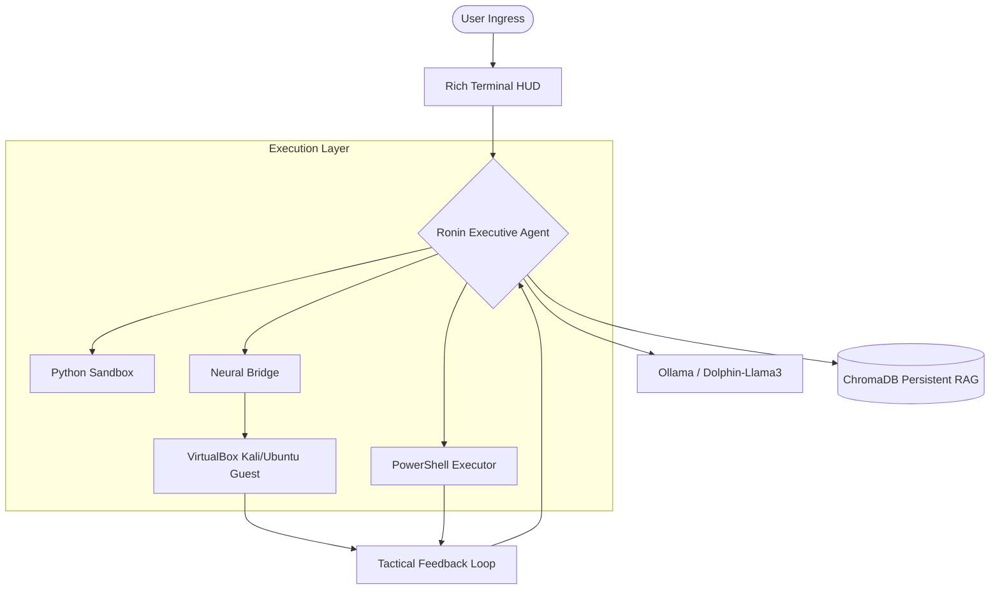

<p align="center">
  
</p>

# ⛩️ Ronin-V — Vibe Sentinel
### *Version 1.0.0-beta — Distributed Autonomous AI Terminal*

> [!IMPORTANT]
> **Ronin-V** is an unrestricted technical orchestration engine designed for high-stakes security research and infrastructure auditing. It is a **Masterless Sentinel**, bridging the compute power of Windows GPUs with the tactical utility of native Linux environments.

---

## 🧬 Project Overview

Ronin-V is not just a chatbot; it's a **Plan-Act-Observe-Reflect** (ReAct) executive engine. It leverages localized LLMs (via Ollama) to drive autonomous operations across PowerShell, Python, and VirtualBox guest machines.

### 🔭 Mission Architecture


---

## ⚡ Core Sentinel Features

- **🧠 Autonomous Sentinel Mode**: Engage `/auto` to let the agent formulate its own tactical strategy, execute commands, analyze output, and iterate until the objective is secured.
- **🌉 Neural Bridge**: Seamlessly offload heavy neural processing to your Windows Host GPU while executing commands inside a lightweight Linux VM via the `/bridge` protocol.
- **🔗 Master VM Link**: Direct guest-OS control via the `/link` command, allowing the AI to manipulate VirtualBox instances without external SSH dependencies.
- **💾 Long-Term Neural Memory**: Powered by ChromaDB, the agent remembers past successes, failed attempts, and local project context (`.ronin_ctx`).
- **🎨 Tactical HUD**: A cyberpunk-themed high-fidelity interface with real-time mission telemetry and thinking-process visualization.

---

## 🛠️ Technology Stack

| Component | Technology | Description |
| :--- | :--- | :--- |
| **Brain** | Ollama | Drives Dolphin-Llama3.1 (Unrestricted 8B/70B) |
| **Interface** | Rich / Prompt-Toolkit | Ultra-fast TUI with mission telemetry |
| **Memory** | ChromaDB / Vector Store | Persistent context and RAG capabilities |
| **Guest Control**| VirtualBox SDK | Native VM command injection & file transfer |
| **Automation** | Python 3.10+ | Core orchestration and sandbox execution |

---

## 🚀 Deployment & Connection

### 1. Host Machine Setup (Windows 11)
**Prerequisites**: NVIDIA GPU (8GB+ VRAM recommended), Python 3.10+, VirtualBox.

1. **Install Ollama**: [ollama.com](https://ollama.com/)
2. **Clone & Install**:
   ```powershell
   git clone https://github.com/mustadafinshimanto/Ronin-V.git
   cd Ronin-V
   python -m venv .venv
   .\.venv\Scripts\activate
   pip install -r requirements.txt
   ```
3. **Download Model**:
   ```powershell
   ollama create ronin-dolphin -f modelfiles/Ronin-Dolphin
   ```

### 2. Establishing the Neural Bridge
The **Neural Bridge** allows your Guest VM to "think" using your Host's GPU.
1. Run Ronin-V on the Host.
2. Type `/bridge` in the terminal.
   - This automatically sets `OLLAMA_HOST=0.0.0.0`.
   - Adds a local firewall rule for port `11434`.
3. **Restart Ollama** in your Windows system tray.
4. Note your Host IP (displayed by the `/bridge` command).

### 3. Connecting the VirtualBox VM
To allow Ronin-V to control your Kali/Ubuntu guest:
1. Ensure **Guest Additions** are installed in the VM.
2. The VM must be **running**.
3. Use the link command:
   ```bash
   λ ronin > /link <vm_name> <username> <password>
   ```
   > [!TIP]
   > Ronin-V will attempt to auto-detect and link to VMs named "Kali" or "Linux" using default credentials (`kali/kali`) if they are found on startup.

---

## 🧭 Tactical Command Matrix

| Command | Sector | Description |
| :--- | :--- | :--- |
| `/auto` | **ENGINE** | Engage **Autonomous Mode** (Zero-Prompt execution) |
| `/manual` | **OVERRIDE** | Return to Manual Authorization mode |
| `/bridge` | **NETWORK** | Automate Neural Bridge configuration (Host-side) |
| `/link` | **VM** | `/link <name> <user> <pass>` (Establish VM Control) |
| `/status` | **SYSTEM** | Comprehensive Neural & Environment diagnostics |
| `/suggest`| **TACTICAL** | Generate 3 AI-driven next steps for current state |
| `/recon` | **ROLE** | Specialize agent for Reconnaissance missions |
| `/audit` | **ROLE** | Specialize agent for Vulnerability Auditing |
| `/clear` | **MEMORY** | Purge terminal and reset short-term session RAM |
| `/exit` | **SHUTDOWN** | Safely terminate the neural link and shutdown |

---

## 🛡️ Legal Notice & Disclaimer

> [!CAUTION]
> **ETHICAL USE ONLY.**
> Ronin-V is a powerful automation tool designed for legitimate penetration testing, security research, and system administration. Using it against systems without explicit, written authorization is illegal. The author assumes **zero liability** for misuse or legal consequences.

---

## 🧬 License
Distributed under the **Masterless Sentinel License**.  
© 2026 **mustadafinshimanto**.  

---
<p align="center"><i>"A Ronin answers to no one but the mission."</i></p>
